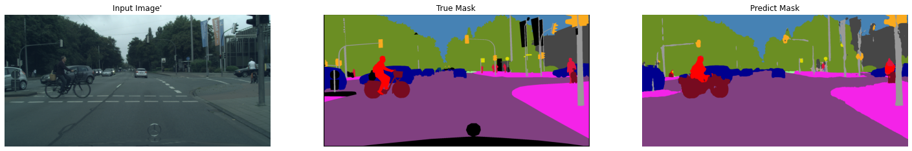
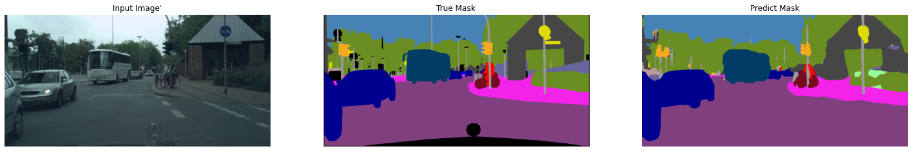

# Semantic Segmentation

## Train

### Requirements
- TensorFlow dataset `cityscapes:1.*.*`  
  See [cityscapes](https://www.tensorflow.org/datasets/catalog/cityscapes) in TensorFlow dataset for dataset preparation.

### Running locally
```
python main.py --workdir=_PATH_TO_CHECKPOINT_DIR_ --config=_CONFIG_FILE_PATH_
```

### Models

| Model                          | Args                                        |
| :----------------------------- | :------------------------------------------ |
| Fast-SCNN                      | --config.model=configs/default_fast_scnn.py |
| Lite R-ASPP MobileNet v3 small | --config=configs/default_lraspp.py          | 
| Lite R-ASPP MobileNet v3 large | --config=configs/default_lraspp.py \ <br> ---config.model=LRASPP_MobileNetV3_Large |

## Inference samples.

### Fast-SCNN



### Lite R-ASPP MobileNet v3 small

